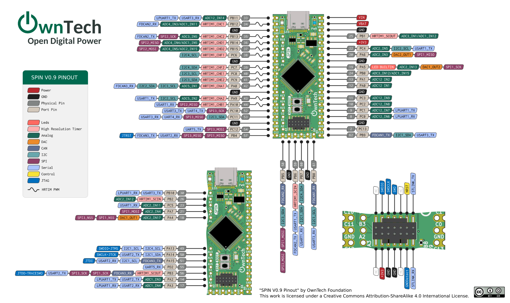

# PinMaker


## Setup

### Get the soft
clone the project `git clone https:/github.com/owntech-foundation/PinMaker.git`

install the dependencies with `python3 -m pip install -r requirements.txt`

### Install the font
Download the recommanded font right here ```https://fonts.google.com/specimen/Inconsolata```

### Adding inkscape to your path (Opionnal)
If you work on mac, chances are high that your Inkscape is not in your path.

on **mac**
```export PATH=$PATH:/Applications/Inkscape.app/Contents/MacOS/```

## Plot Spin

run `python3 main.py -p input/SPIN.json -l`

The raw svg out of PinMaker: \


Image cleaned up with filters (-oc -os): \


## Options

The following options are supported

### Required

`-p` or `--pins` folled by the pins.json file you want to plot.
You may add multiple pin files in a single command.

### Optionals

`-s` or `--style` followed by the **style.json** file. 
By default the style.json file is read.

`-w` or `--show` enable the png render.
**discalaimer**: the rendered image is not 100% accurate and should only be used for debug purposes

`-i` or `--inkscape` open inkscape after the execution of the program.
**note**: you need the have inkscape in your PATH.

`-o` or `--output` followed by the name of the **output.json** file.
By default the output file is **pinout.json**

`-os` or `--omit_styles` followed by the ...

`-oc` or `--omit_categories` followed by the ...

`-l` or `--legend` enable the **legend**
