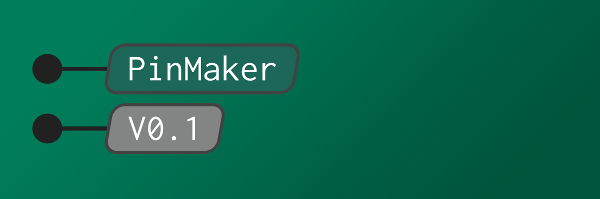

# PinMaker



## Setup

### Get the soft
clone the project `git clone https://github.com/owntech-foundation/PinMaker.git`

install the dependencies with `python3 -m pip install -r requirements.txt`

### Install the font
Download the recommended font right here ```https://fonts.google.com/specimen/Inconsolata```
For Linux : 
1. `sudo cp Inconsolata-VariableFont_wdth,wght.ttf /usr/share/fonts/truetype/`
2. `sudo fc-cache -fv `
3. Check it is installed : ` fc-list | grep -i "Inconsolata" `


### Adding Inkscape to your path (Optional)
If you work on Mac, chances are high that your Inkscape is not in your path.

on **mac**
```export PATH=$PATH:/Applications/Inkscape.app/Contents/MacOS/```

## Plot Spin

run `python3 main.py -p input/SPIN.json -l`

The raw SVG out of PinMaker: \


Image cleaned up with filters (-oc -os): \


## Options

The following options are supported

### Required

`-p` or `--pins` followed by the pins.json file you want to plot.
You may add multiple pin files in a single command.

### Optionals

`-s` or `--style` followed by the **style.json** file.
By default, the style.json file is read.

`-w` or `--show` enable the png render.
**Disclaimer**: the rendered image is not 100% accurate and should only be used for debugging purposes

`-i` or `--inkscape` open Inkscape after the execution of the program.
**note**: you need to have Inkscape in your PATH.

`-o` or `--output` followed by the name of the **output.json** file.
By default the output file is **pinout.json**

`-os` or `--omit_styles` followed by the desired omitted style.

`-oc` or `--omit_categories` followed by the desired omitted category. 
Possible categories are listed in the input file. 
`alternate` and `extended` are possible arguments.

`-l` or `--legend` enable the **legend**

`-f` or `--font`
Path to a font file to embed in the SVG output (e.g., for using a custom font).

`-ps` or `--paper_size`
Paper size to use for the SVG canvas. Supported values: `A3`, `A4`, `A5`.
Default is `A4`.

`-po` or `--paper_orientation`
Paper orientation for the canvas. Supported values: `Portrait`, `Landscape`.
Default is `Portrait`.
